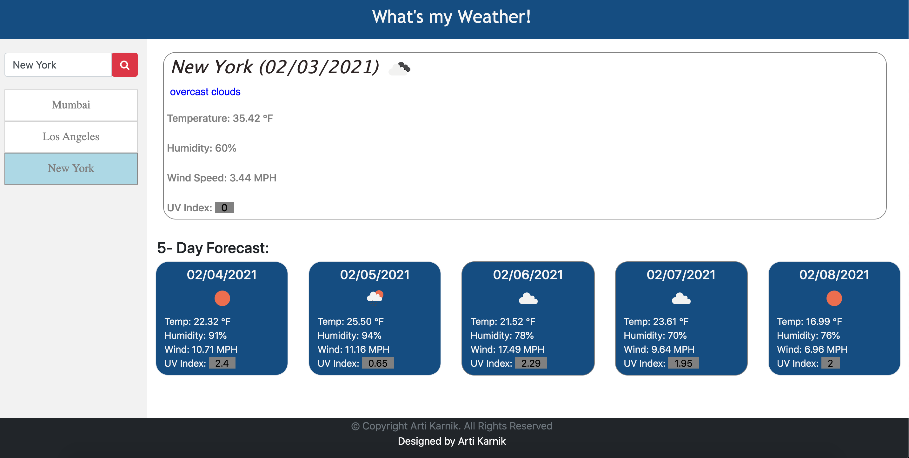

# WeatherApp

<strong> Project Summary: </strong>  
Application to get current and 5-day weather forecast for given city name. Searches get saved locally.

      

 

<strong> Description: </strong>  
=>  This is a weather app that will allow users to search for desired city and get it's current day + next 5 days of weather details. Details like current & forecasted temperature, humidity, UV index & wind  details are displayed.

=> City searches get saved as a list below the search box & user can simply click on the city name again to view it's weather details.

  

<strong> Code Installation: </strong>  
$ cd [path_to_save_codebase]  
$ git clone https://github.com/arti-karnik/WeatherApp  

<strong> Github Profile: </strong>  
https://github.com/arti-karnik

<strong> Application Live URL: </strong>  
https://arti-karnik.github.io/WeatherApp/
